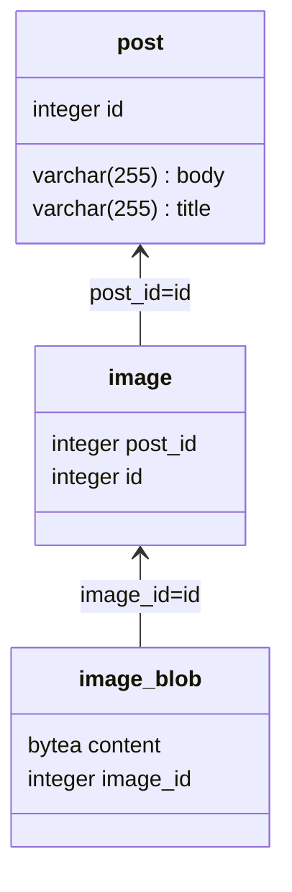

# BlazeAndBoot

##### What is this repo ?
This is a training repo in order to learn how to integrate Spring Data JPA / Hibernate and Blaze Persistence in the same project.\
I have a sample DB with a classic usage of **image_blob** in a unidirectional one-to-one relationship with **image**. This is a 
relation that exists in my main project and I want to use Blaze's EntityView on this relation. 

##### The database diagram

