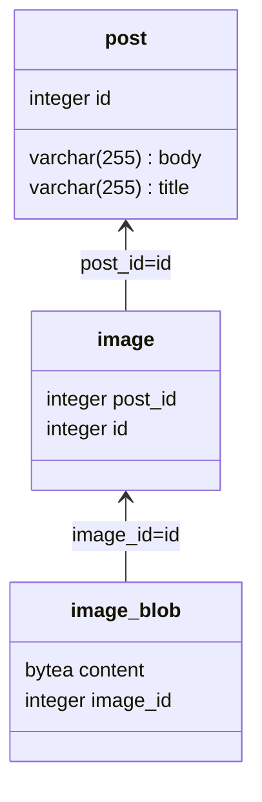
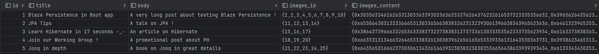

# BlazeAndBoot

##### What is this repo ?
This is a training repo in order to learn how to integrate Spring Data JPA / Hibernate and Blaze Persistence in the same project.

The other problematic I want to work on with this repo is that how to avoid object mapping for (at least) read operations.

I have a sample DB with a classic usage of **image_blob** in a unidirectional one-to-one relationship with **image**. This is a 
relation that exists in my main project and I to know if the use of Blaze's EntityView on this relation is worth. 

I also work with several Hibernate Features, like Dto projections & Result Transformers. 

##### The database diagram



##### The SQL query

I want to end with a `Post` object that contains the list of Image and for each Image I want to fetch the blob content.
In native SQL we can write :
```sql 
SELECT p.id, p.title, p.body, array_agg(i.id) as images_id, array_agg(ib.content) as images_content
                        FROM post AS p
                            JOIN image AS i ON p.id = i.post_id
                            JOIN image_blob AS ib ON i.id = ib.image_id
                        GROUP BY p.id ORDER BY p.id LIMIT 4;
```
As a result we have :



To map this result to a Java object based on this native query, I can use Hibernate Result Transformer. And more precisely with
the setResultListTransformer method.

With Dto projections, I didn't achieve to work with that query. JPQL query has to be different because it doesn't handle 
`GROUP BY` clause as far as I know. 
I had more or less similar result with two approach : 
1) Running successive queries with dto projections. The first one fetch all posts. And for each post I run an additional query to fetch associated images id and contents.
2) Running only one query, but it leads to multiple objects (one per tuple), so if a post have 5 images, I end with 5 different Post objects. I think it is not useful.

##### Current status

At the moment, I didn't push Blaze Persistence understanding enough to compare it with Hibernate solutions. But my flavored solution is currently the native SQL query plus the result transformer :
it is a bit of code to write and maintain, but it is one only query, and I end with all the data I need.